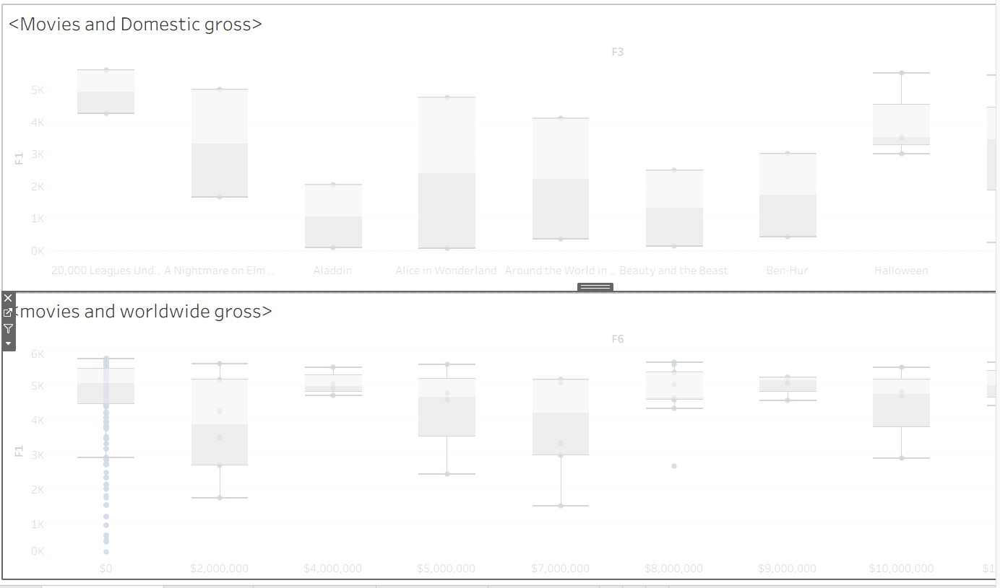
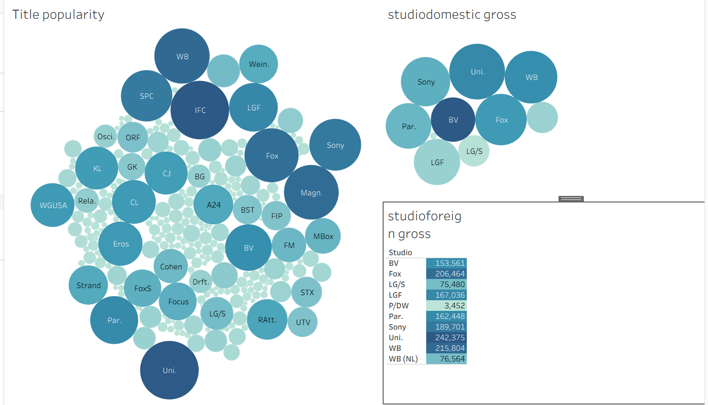

<h2><b>Project Name -FILM IS GOLD</b></b></h2>
<h2> 1.Business Understanding</h2>
<h4> A film Industry is a monopolistic industry offering goods and services of similar in nature, but different companies, for instances will use different differentiation techniques to attract clients and increase revenue base. These many firms in the film industry are coming up with many and, different innovative techniques to penetrate and increase their market share, edge out their weak competitors, and increase the revenue base. This  cut-throat business competition is not healthy for our film company and it is the reason why the main features driving revenue generation in the film industry should be identified and their effect sizes determined scientifically.  This analysis will promote sound film business establishment and remove uncertainity in the film industry because features and revenue size will be probabilistically identified.</h4>
<h3> 1.1 OBJECTIVES </h3>
<h4> To predict the performance of firms in the film Industry using each record in the datasets.</h4>
<h4> 1.1.2 Specific objectives </h4>
<h4> . To identify the tltles thata are most popular </h4>
<h4> . To identify the tltles thata are most profitable</h4>
<h4> . To identify the movies thata are most profitable</h4>
<h4> . To identify the studios thata are most profitable </h4>
<h3>1.2 Data Understanding</h3>
<h4> Data analysed comprised of data from im.d, database data and it demonstrated relationship between writers, persons, directors, moviesn titles and studios</h4>
<h4> Data of CSV in nature and this CSV data comprised of movies.csv, studios.csv and csv data for titles and popularity</h4>
<h4> This data assisted in obtaining titles that are popular, movies that are profitable, studios that are profitable.</h4>
<h3><b>1.3 Visualization</b></h3>

Dashboard 1

Dashboard 2

<b>Conclution</b></h3>
